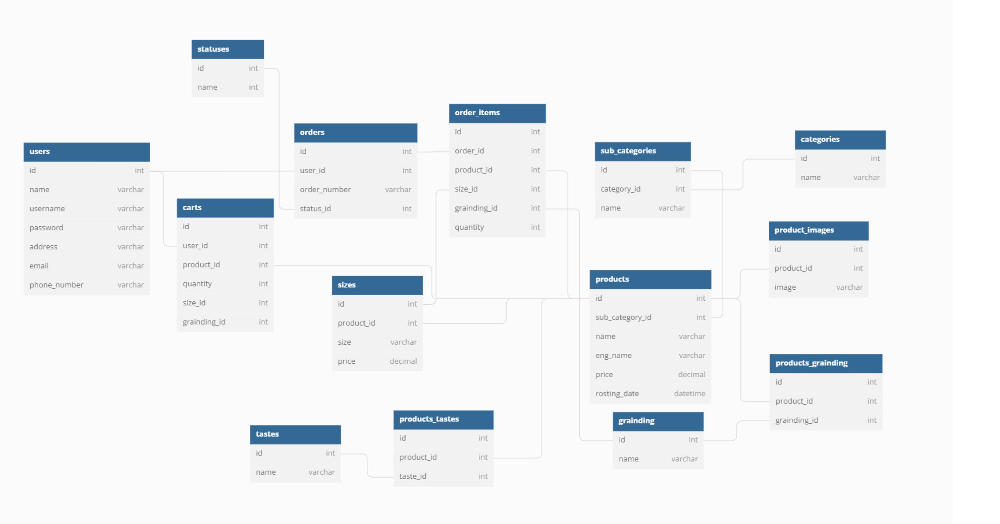

# Terarosa Service

<bt>

##### <본 프로젝트는 팀 프로젝트 이후 `Django REST FrameWork`를 적용하기 위한 개인 프로젝트 입니다> 
##### <팀 프로젝트의 레포지토리는 https://github.com/wecode-bootcamp-korea/35-1st-kleenex-backend 을 참조해주세요!!>
<br>


### 커머스사이트의 고객의 흐름에 맞는 REST API 작성  


<br>

## 목차

  * [개발 기간](#개발-기간)
  * [개발 인원](#개발-인원)
  * [프로젝트 개요](#프로젝트-개요)
      - [프로젝트 설명](#01-프로젝트-설명)
      - [개발 조건](#02-개발-조건)
      - [사용 기술](#03-사용-기술)
      - [모델링](#04-모델링)
      - [디렉토리 구조](#05-디렉토리-구조)
  * [프로젝트 분석](#프로젝트-분석)
  * [API ENDPOINT](#api-endpoint)


<br>

## 개발 기간
**2022.11.16 ~ 2022.11.18** 

<br>
<br>
  
## 개발 인원
**Back-end  : 김도연**

<br>
<br>


## 프로젝트 개요


<br>

#### 01. 프로젝트 설명

<u>일반적인 커머스사이트의 기능들을 분석하여 자유롭게 API를 구현했습니다.</u>
 
<br>
<br>

#### 02. 개발 조건

> <br>
>
> * **데이터**
> 	* 테라로사 사이트의 데이터 분석 후 필요한 데이터 추출
> 	* 데이터에 맞는 모델링 실시
>
><br>
>
> * **API**
>
>   *   **회원가입 & 로그인**
>       * 동일한 회원의 가입에 대해서는 자유롭게 오류처리
>       * 인가된 사용자에 한해서 장바구니 기능 사용
>    
>   *   **메인페이지 상품리스트**
>        * 가격에 대해서는 내림차순, 신서도는 Roasting 날짜를 기준으로 정렬 구현
>        * 메인페이지에 각 상품에 대해 3개의 상품을 출력 구현
>
>   *   **상품 리스트**
>        * 한 페이지에 자유롭게 상품 출력수 제한 구현
>        * 필터링을 이용한 상품리스트 자유롭게 구현
>   
>   *   **상세 상품**
>        * 상품의 상세 정보 출력
>
>   *   **장바구니 CRUD**
>        * 상품을 장바구니에 담기, 조회, 수정, 삭제 자유롭게 구현
>
> <br>

<br>
<br>


#### 03. 사용 기술 

- **Back-End** : Python, Django, Django REST Framework
- **Database** : MySQL, dbdiagramio
- **HTTP**     : Postman
- **ETC**      : Git, Github, Miniconda


<br>
<br>

#### 04. 모델링

<br>


<p align="center"></p>

<br>

- 커머스 사이트의 일반적인 데이터를 고려하여, `User(유저)`, `Product(상품)`, `Cart(장바구니)`, `Order(주문)` 을 주요 테이블로 설정했습니다.
	- `User(사용자)`는 **여러 개**의 `Cart(장바구니)` 객체를 가질 수 있습니다.
	- `Cart(장바구니)`에 유저의 아이디를 외래키로 받아 장바구니 기능 구현시 유저를 특정할 수 있습니다.
    - 하나의 `Cart(장바구니)`는 **여러 개**의 `Product(상품)`을 가질수 있습니다.

<br>

-  `Product`에는 상품별 옵션이 있으며, `Size`로 가격이 다르게 된다.  상품에따라서 `Taste`가 별개로 존재한다. 
    - `Product(상품)` 테이블과 `Size` `Grainding` `Taste` 3개의 테이블은 M:N 관계로, 관계 해소를 위해서 중간테이블을 설정했습니다.
    - ManyToManyField의 Through 옵션을 이용해서 직접 중간 테이블을 설정했습니다. 
<br>

-  `Image`, `Category`, `Subcategory` 테이블의 경우 상품과의 관계는 1:N 입니다.
    - 하나의 `Product`는 여러개의 사진을 가질 수 있습니다.
    - 하나의 `Product`는 하나의 `Subcategory`에 포함됩니다.

<br>
<br>

#### 05. 디렉토리 구조
<br>


```
.
├── __pycache__
├── carts
├── configs
├── decorators
├── products
├── terarosa
├── users 
    ├── utils
├── exceptions.py
├── manage.py
└── requiremenets.py
 
```


<br>
<br>

## 프로젝트 분석

<br>

- `users`, `products`, `carts`로 분리하여 앱을 생성했습니다.   
<br>

- 회원가입&로그인 API
    - `bcrypt` 모듈을 이용해서 데이터베이스의 패스워드 암호화
    - `jwt` 모듈을 이용해서 인가를 위한 token 발급
    - decorator를 구현해서 인가가 필요한 기능에 추가
    - 정규표현식을 활용, 유저이름, 이메일, 비밀번호 입력에 대한 유효성 검사
    - unique옵션에 해당하는 필드에 대해서 `check_필드명()`함수를 정의해서 중복 확인 
<br>
<br>
<br>

- 상품조회 API
    - 어려웠던점
        - 상품에 대해서 출력시 옵션이 foreign key로 연결되어 있어서, 참조에 참조를 통해서 가지고 와야하는지가 고민이 되었습니다.
        - model serializer를 사용하게 되면, foreign key로 연결된 데이터에 대해서는 정확히 출력이 되지 않았습니다. 
<br>
<br>
<br>
    - 해결방법
        - `nest serializer`를 활용해서 product serializer에 옵션들의 model serializer를 포함 시켜 주었습니다.
        - 필드에 대해서는 역참조를 이용해서 예를 들어 fields에 `size_set`, `productimage_set`으로 참조해서 serializer를 활용했습니다.
<br>
<br>
<br>    
    - 설명
        - 메인페이지의 가격과 신선도에 해당하는 상품을출력 
            - `get(필드명)`함수를 정의해서 상품에 대해서 내림차순으로 3개의 상품을 출력하는 함수를 구현
            - 가격과 신선도 이외에 다른 필드를 입력시 해당 필드에 대해서도 출력 가능  
        - 전체 상품리스트 출력
            - django의 `Q`를 활용해서 조건이 있을 경우 조건들을 하나로 통합
            - `distinct()`로 중복되 쿼리셋 제거
            - `offset` 과 `limit` 를 활용해서 pagination을 구현했습니다. 
            - `ProductModelSerializer`를 정의해서 `many=True` 옵션으로 해당 product쿼리셋을 dict형태로 반환
        - 특정 상품 출력
            - `path 파라미터`로 상품의 아이디를 받아서 상품을 특정함
            - `ProductDetailSerializer`로 해당 상품을 dict로 반환  
        - 상품 검색
            - `쿼리 파라미터`로 search를 받아 search가 포함된 상품을 반환
        

<br>
<br>
<br>

- 장바구니 API
    - 어려웠던점
        - 장바구니 객체를 출력하는 경우, 기존에 정의된 상품에 대한 옵션을 가지고 와야한다는 점에서 어떻게 접근해야하는지가 고민되었습니다.
<br>
    - 해결
        - 리스트 출력시 serializer에 `source` 옵션을 활용해서 해당 장바구니에 담긴 상품의 옵션을 참조해서 출력할 수 있었습니다.   
<br>    
    - 설명
        - 장바구니 생성
            - 하나의 상품에 옵션별로 다른 장바구니 객체가 생성되기 때문에, 입력받는 데이터가 리스트가 되어 for문을 통해서 하나씩 꺼내어 장바구니 객체 생성
            - `get_or_create`를 활용, 기존에 장바구니에 생성된 상품이 있다면, 해당 상품의 개수를 증가시키는 식으로 구현     
        - 장바구니 리스트 출력
            - serializer의 `source` 옵션을 활용해서 외래키로 연결된 데이터에 접근해서 값을 출력함
            - 다른 옵션의 경우 `정참조`로 가능하나, 상품의 image에 대해서는 `nest serializer`와 `source`를 모두 활용해서 `역참조`로 데이터 출력
        - 장바구니 수정
            - 장바구니 상품 수량을 수정
            - `음수`로 변경하려는 경우 `CanNotNegative()` 에러 처리 
        - 장바구니 삭제
            - `path 파라미터`를 활용해서 장바구니 객체를 특정 후 삭제
<br>
<br>
<br>
<br>
<br>


## API ENDPOINT

### users

URL|Method|Description|
|------|---|---|
|"/user/signup"|POST|회원가입|
|"/user/login"|POST|로그인|

<br>
<br>
<br>

### products

URL|Method|Description|
|------|---|---|
|"/products/main"|GET|메인페이지의 가격과 신선도 정렬로 상품 출력 |
|"/products/coffee_list"|GET|상품리스트 출력|
|"/products/coffee/\<int:product_id>"|GET|특정 상품 출력 |
|"/products/search?search="|GET|search로 들어오는 파라미터에 대해서 상품 출력|

- 상품리스트 출력의 경우 sort, category, taste, limit, offset을 쿼리 파라미터로 정할 수 있다.

<br>
<br>
<br>

### carts

URL|Method|Description|
|------|---|---|
|"/carts"|POST|장바구니 객체 생성|
|"/carts"|GET|장바구니 리스트 출력|
|"/carts/\<int:cart_id>"|PATCH|특정 장바구니 객체 수정|
|"/carts/\<int:cart_id>"|DELETE|특정 장바구니 객체 삭제|


